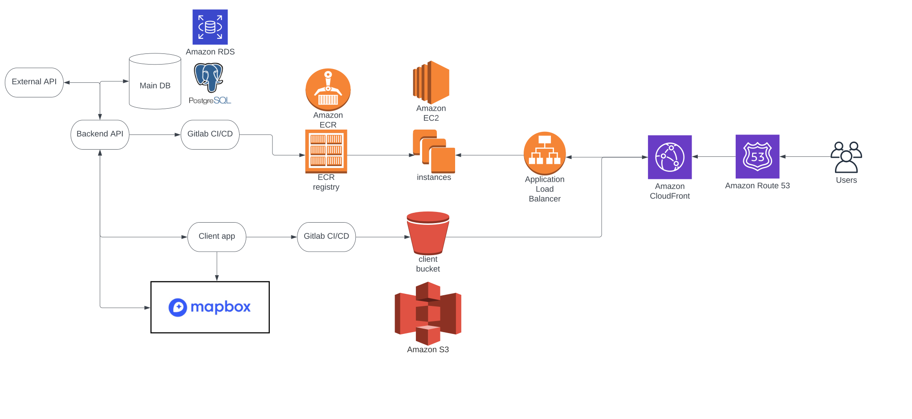

<h1 align="center">Logistic app</h1>

# Technologies used:
#### Backend
* Node.js
* Nest.js
* CASL
* TypeORM
* AutoMapper
#### Frontend
* Vue.js (3.0)
* Vuex
* Composition API
* TypeScript
* Mapbox
* Turf.js
#### Database
* Postgresql
#### Documentation
* Swagger
#### Containerization
* Docker
#### Cloud
* AWS

## Additional Info

For better understanding of project workflow, you can see a diagram below or find it in "docs" folder, that represents logic of current program.

# License

Distributed under the MIT License. See `LICENSE` for more information.

<!-- Credits -->
# Credits

[Lionwood.software](https://lionwood.software/) - hr@lionwood.software, sales@lionwood.software

Project Link: [https://nit.school/](https://github.com/your_username/repo_name)
